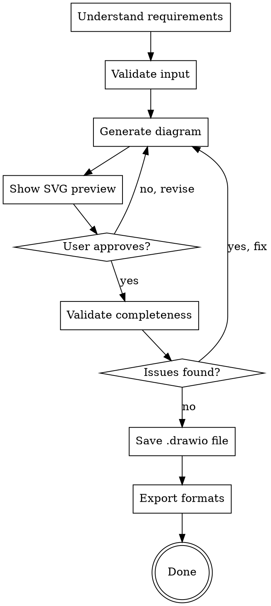

## Enterprise Preamble

- Stay inside the current project unless the user explicitly names another path.
- Do not call public telemetry, public update checks, public tunnels, cookie import, or public scraping flows.
- Use policy-gated tools only when the active profile allows them.
- Commit after each discrete behavior change — do not accumulate unrelated edits across multiple files before committing.
- Each commit message must follow Conventional Commits: `<type>[scope]: <description>` (types: feat, fix, docs, refactor, test, chore, perf, ci).
- Never use `--no-verify`, `--force` (use `--force-with-lease`), or `--no-gpg-sign` unless explicitly instructed.
- Sequence for rebasing: stage → commit → fetch → rebase → push.

# Diagram Generation

Generate Draw.io diagrams from plain-text descriptions. Supports 8 diagram types with client-side SVG preview.

## Checklist

You MUST create a task for each of these items and complete them in order:

1. **Understand requirements**
   - [ ] Ask: What type of diagram? (flowchart, architecture, ER, sequence, class, state, mind-map, swimlane)
   - [ ] Ask: What's the scope? (how many components/entities/actors?)
   - [ ] Ask: Are swimlanes needed? (for sequence/process diagrams)
   - [ ] Ask: Approval path? (who reviews before export?)

2. **Validate input**
   - [ ] Description >= 50 characters? If not, ask user to elaborate
   - [ ] Diagram type is one of: flowchart, architecture, ER, sequence, class, state, mind-map, swimlane
   - [ ] All key actors/entities/components named
   - [ ] Relationships/connections clear

3. **Generate diagram**
   - [ ] Invoke `/diagram-agent` routing skill OR use MCP directly
   - [ ] MCP call: `create_diagram` with format (prefer Mermaid for standard types, XML for custom layouts)
   - [ ] Capture SVG preview from response
   - [ ] Verify no rendering errors

4. **Show preview**
   - [ ] Display embedded SVG inline (no separate browser tab yet)
   - [ ] Ask: "Does this match your intent?"
   - [ ] If NO: ask what should change, loop to step 3
   - [ ] If YES: continue

5. **Validate diagram**
   - [ ] Invoke `/diagram-validate` skill
   - [ ] Checklist: all labels present? connections complete? swimlanes correct?
   - [ ] Fix any issues found

6. **Save diagram**
   - [ ] Save to `.drawio` file in `docs/diagrams/<name>.drawio`
   - [ ] Commit: `feat: add <diagram-name> diagram`

## Process Flow



**The terminal state is saving `.drawio` file.** Do NOT assume user wants PNG/PDF exports until explicitly asked.

## The Process

### Step 1: Understand Requirements

Check current project state first:
- Existing diagrams in `docs/diagrams/`?
- Spec or architecture doc already written?
- Are we documenting existing system or designing new one?

Assess scope:
- If request describes multiple independent systems (e.g., "draw auth flow AND data pipeline AND deployment"), decompose first: What's the highest priority? Build that diagram first.
- If single focused diagram, proceed.

Ask questions one at a time:

**Question 1: Diagram Type**

"What type of diagram best matches your intent?"

Options with examples:
- **Flowchart:** "Show the login flow: user → auth → session → app"
- **Architecture:** "Sketch the microservices: API gateway, auth service, data service, cache"
- **ER (Entity-Relationship):** "Design the data model: users table, orders table, relationships"
- **Sequence:** "Show interaction: client → API → database → API → client"
- **Class:** "Design OOP structure: Base class, derived classes, inheritance"
- **State:** "Show state machine: pending → in-progress → complete → archived"
- **Mind-Map:** "Brainstorm feature breakdown: Search → Results → Details → Sharing"
- **Swimlane:** "Show cross-functional flow: Sales phase (sales team) → Delivery phase (ops team)"

Wait for answer before proceeding.

**Question 2: Scope**

"How many components/entities/actors are we visualizing? (Estimate is fine)"

- Small: 3-5 elements
- Medium: 6-12 elements
- Large: 13-20 elements
- Too large: 20+ elements (split into multiple focused diagrams)

If too large, help user decompose first.

**Question 3: Special Requirements**

"Any special needs?
- Swimlanes (for organizing by actor/responsibility)?
- Specific shapes (AWS, Azure, Kubernetes)?
- Color coding (by layer, by status)?
- Annotations (descriptions on connections)?"

### Step 2: Validate Input

Before generating:
- Description must be clear enough to generate from
- If description is vague ("show how the system works"), ask for specifics
- User must have named all key actors/entities
- All relationships/connections must be explicit

Anti-patterns to catch:
- ❌ "Make a diagram" (no description)
- ❌ "Show everything" (no scope)
- ❌ "Complex system" (needs decomposition)
- ✅ "Login flow: user enters email → system validates → sends OTP → user enters code → creates session"

### Step 3: Generate Diagram

Invoke MCP directly or via /diagram-agent:

```bash
# Option A: Via diagram-agent routing
/diagram-agent --generate --type flowchart --description "..."

# Option B: Direct MCP call
drawio-mcp create_diagram \
  --format mermaid \
  --type flowchart \
  --description "Login flow..."
```

Choose format:
- **Mermaid:** Flowchart, sequence, class, state, ER, mind-map (simpler, 95% of cases)
- **XML:** Custom layouts, specific positioning, when Mermaid insufficient

Mermaid example:
```
flowchart TD
    A[User enters email] --> B{Email exists?}
    B -->|Yes| C[Send OTP]
    B -->|No| D[Create account]
    C --> E[User enters code]
    E --> F{Code valid?}
    F -->|Yes| G[Create session]
    F -->|No| H[Retry]
```

Capture SVG preview and show user.

### Step 4: Show Preview & Get Approval

Display SVG inline in conversation:

"Here's your flowchart. Does this match your intent?"

If user says:
- **No:** "What should change?" → revise and regenerate (loop to step 3)
- **Yes:** Continue to step 5

Never export without explicit user approval.

### Step 5: Validate Completeness

Invoke `/diagram-validate` skill:

```bash
/diagram-validate --file <diagram.drawio>
```

Checklist validation returns:
- [ ] All nodes labeled (no unnamed boxes)
- [ ] All connections have endpoints (no dangling edges)
- [ ] Swimlanes (if present) properly defined
- [ ] No self-loops (node pointing to itself)
- [ ] No unreachable nodes (disconnected from flow)

Fix any issues, regenerate if needed.

### Step 6: Save & Commit

Save to project:

```bash
mkdir -p docs/diagrams
cp diagram.drawio docs/diagrams/login-flow.drawio
git add docs/diagrams/login-flow.drawio
git commit -m "feat: add login flow diagram"
```

### Step 7: Export (If Requested)

User asks: "Can I export this to PNG?"

Invoke `/diagram-export` skill:

```bash
/diagram-export --input login-flow.drawio --formats png,svg,pdf
```

Saves alongside `.drawio` file.

## Diagram Examples

### Example 1: Simple Flowchart

**User Request:** "Draw the login flow"

**Skill Process:**
1. Ask: "Diagram type?" → Flowchart
2. Ask: "Scope?" → 6 steps (email → validate → OTP → code → session → redirect)
3. Ask: "Special needs?" → None
4. Generate flowchart
5. Show SVG preview
6. User approves
7. Validate (all nodes labeled, connections complete)
8. Save to `docs/diagrams/login-flow.drawio`
9. Done

**Output:** `.drawio` file + SVG preview in docs

### Example 2: Architecture Diagram

**User Request:** "Sketch our microservices architecture"

**Skill Process:**
1. Ask: "Diagram type?" → Architecture
2. Ask: "Scope?" → 8 services (API gateway, auth, users, orders, payments, notifications, cache, database)
3. Ask: "Special needs?" → "Show AWS icons and data flow"
4. Generate architecture diagram with AWS shapes
5. Show SVG preview
6. User requests: "Add load balancer"
7. Regenerate with load balancer
8. User approves
9. Validate (connections complete, all services labeled)
10. Ask: "Export to PNG?" → Yes
11. Export PNG (for docs)
12. Save both `.drawio` and `.png`
13. Done

**Output:** `.drawio` + `.png` files + SVG preview

### Example 3: Data Model (ER)

**User Request:** "Design the database schema for our e-commerce platform"

**Skill Process:**
1. Ask: "Diagram type?" → ER (Entity-Relationship)
2. Ask: "Scope?" → 7 entities (users, products, orders, order_items, categories, inventory, reviews)
3. Ask: "Special needs?" → "Show relationships and cardinality"
4. Generate ER diagram with Mermaid syntax
5. Show SVG preview
6. User requests: "Add created_at timestamps to all tables"
7. Regenerate with timestamp fields
8. User approves
9. Validate (all entities labeled, relationships clear)
10. Save to `docs/diagrams/ecommerce-schema.drawio`
11. Done

**Output:** `.drawio` file, ready for implementation

## Anti-Patterns: What NOT to Do

❌ **"This is just a simple diagram"**

Treat all diagrams with same rigor. Simple diagrams need validation too.

❌ **Generating without asking type first**

User: "Draw this"
Wrong: Generate flowchart as default
Right: Ask "flowchart, architecture, or ER?" first

❌ **Creating overly detailed diagrams (15+ components)**

If diagram has 15+ components, it's too complex. Break into 2-3 focused diagrams.

❌ **Showing 10 revisions before getting approval**

Generate → Preview → Approve → Validate. Don't generate 10 times.

❌ **Using XML when Mermaid would be simpler**

80% of diagrams: Mermaid is enough
20% of diagrams: XML for custom positioning

Default to Mermaid.

❌ **Exporting without user approval**

Always preview → approve → then export.

❌ **Saving without committing**

Always commit with message: `feat: add [diagram-name] diagram`

## Policy Requirements

**MCP Egress:** Diagram generation requires explicit approval to connect to `drawio-mcp` server.

Policy gate in metadata:
```yaml
approval-gates:
  policy-required: [mcp-egress]
```

Inform user: "This will connect to draw.io MCP to generate your diagram. OK?"

If user declines: Use offline Mermaid generation (if available) or ask user to enable MCP access.

## Output Rules

Always output:
1. Diagram type confirmed (flowchart, architecture, ER, etc.)
2. SVG preview inline (so user can see without saving)
3. Save location: `docs/diagrams/<name>.drawio`
4. Git commit message: `feat: add <name> diagram`

Never output:
- Raw XML (show SVG instead)
- File paths outside project
- Placeholder descriptions

## See Also

- [`diagram-validate`](../diagram-validate/SKILL.md) — Validate completeness
- [`diagram-export`](../diagram-export/SKILL.md) — Export PNG/SVG/PDF
- [`diagram-search`](../diagram-search/SKILL.md) — Find shapes & templates
- [`diagram-agent`](../agents/diagram-agent/SKILL.md) — Specialist agent
- [Diagram Examples](../../references/diagram-examples.md)
- [drawio-mcp Docs](../../docs/DRAWIO-MCP-ANALYSIS.md)

